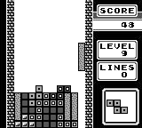
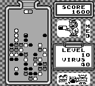
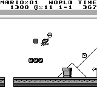
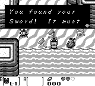
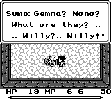
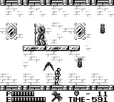
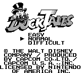
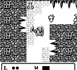

# gbe4k
gbe4k is another Game Boy Emulator written in Kotlin

This won't be world's most accurate or best Game Boy emulator out there, but the reason for this project's existence is for me to learn something. 

The goals I am setting for this emulator are to have it run some of my favorite game boy games of all time: 

 * Tetris ✅
 * Dr. Mario ✅
 * Super Mario Land ✅
 * Pokémon Red & Blue ❌
 * The Legend of Zelda: Link's Awakening ✅
 * Final Fantasy Adventure ✅
 * Castlevania II: Belmont's Revenge ✅
 * DuckTales ✅
 * Gargoyle's Quest ✅
  
Screenshots
----------

